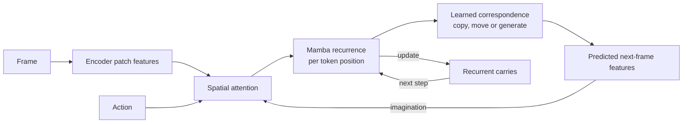

# D4MJ

**Building a Mamba world model for learning in imagination.**

[Dreamer 4](https://arxiv.org/abs/2509.24527) learns a world from video, then trains an agent inside that world. This project began with two changes we wanted to investigate: replace iterative latent generation with JEPA-style feature prediction, and replace temporal attention with Mamba's recurrent memory. The appeal is a world model that can predict directly and carry history forward in a fixed-size state.

Getting those pieces to run together was the beginning. The harder question became whether the imagined world preserves the consequences that an agent needs to learn from.

## Starting with a working agent

The early prototypes paired JEPA representation learning with recurrent dynamics. To establish the Dreamer-style learning loop, we then built a reduced Transformer baseline on CartPole. Its imagination-trained actor reached **281.33 return against 249.32 for its behavior-cloning policy** over 100 fresh evaluation seeds. This gave the subsequent architectural experiments a working control baseline. [Baseline and actor results](d4_mamba_jepa/README.md).

Craftax-Classic made the problem much richer. An agent has to remember terrain, distinguish movement from a blocked move, collect resources, make tools and survive encounters. A world can get the scenery mostly right while missing the single health change or tile interaction that should change the agent's decision.

Early Craftax experiments showed that training could erode information already present in the visual encoder. Slowing its learning rate preserved much of that information. The next study gave us a more controlled way to examine the representation and dynamics separately. [Encoder experiments](d4_mamba_jepa/spec/ABLATIONS.md).

## What Direct and Flow taught us

The next study separated two choices: **Flow versus Direct prediction**, and **attention versus Mamba dynamics**. All four arms shared a frozen visual representation. Flow generated the next latent through several refinement passes; Direct predicted it from the committed world state and action in one pass.

Doubling the exported representation from **32 to 64 slots** recovered information lost at the bottleneck across two encoder seeds. Changing how the candidate action entered the predictor also improved action-effect fidelity. Yet the later Direct-Mamba actor still lost to its own behavior-cloning policy. We could improve prediction and action sensitivity without producing a better agent. [Experiment history](d4mj/spec/DECISIONS.md).

The shared encoder had been trained for reconstruction, and dynamics inherited its features as fixed prediction targets. This motivated a new family of experiments: learn the representation together with dynamics, so that prediction itself helps shape the state.

## Learning the state, then opening it up

[LeWorldModel](https://arxiv.org/abs/2603.19312) offered a compact way to train encoder and predictor jointly, using next-embedding prediction and a regularizer against representation collapse. We adapted it to Mamba and compared ordinary SIGReg (**Raw**) with temporally centered SIGReg (**TC**), which emphasizes variation within a sequence.

Joint Raw/TC experiments exposed fresh problems. TC's prediction loss plateaued. In the later canonical baseline, Raw completed joint training and a two-step imagination bridge, but its action-selection evaluation failed: generated successors supported safe choices on **45.1%** of the tested opportunity states, against **65.7%** for a control using global action averages. [Raw/TC training](artifacts/experiments/20260906_lewm_paired/README.md), [bridge evaluation](artifacts/experiments/20260921_m4_baseline/RESULT.md).

We worked backward through the prediction and readout pipeline, also revisiting Direct. Its death AUC rose from **0.441 to 0.788** when the same probe family was fitted on generated features. A decoder trained on observed states had been obscuring information readable from imagination. Readers trained to classify outcomes could also order actions badly; a ranking loss substantially improved their choices on the same features. [Readout transfer](artifacts/experiments/20260917_generated_readout/README.md), [ranking experiments](artifacts/experiments/20260919_localization_ladder/README.md).

The terminal supervision contained a separate shortcut: death was always attached to the second generated step, so the head learned generation depth as a death cue. The experimental bridge supervision was revised to vary that depth.

The clearest architectural result came from comparing outputs of the same frozen encoder. On **800 fresh decision states**, a patch-feature readout achieved **73.2% expected survival after its chosen action**, against **65.2%** for CLS, the single summary token supplied to the world. A CLS head with 40 times more capacity failed to close the gap. The encoder had useful local information that its exported summary served poorly. [Interface experiment](artifacts/experiments/20260921_readout_ladder/BOUNDARY.md).

Compressed patch summaries recovered part of that information. Working directly with per-tile features then let us preserve local structure and inspect where each predicted feature came from. This led to the current spatial world: attention mixes information within each frame, while Mamba carries each token's history through time. We call this backbone **fmamba**.

The output learns to reuse existing features, shift them as the view moves, or generate new content. This helped a failure that direct per-tile prediction had exposed: relearning unchanged content could be harder than simply copying it. Longer training also taught many mining and placement interactions that early checkpoints missed. [Spatial models and experiments](artifacts/experiments/20260927_levers/tworld.py).

## What the recurrent model actually remembers

With the spatial interface in place, we could test the original Mamba thesis more directly. We removed older observations while holding the latest five frames, actions and time positions fixed. Across two initializations, Mamba retained more useful information than the attention control about terrain last seen **6–15 steps earlier**. Resetting its state-space memory removed nearly all of that older-history benefit. [Controlled memory experiment](artifacts/experiments/20260927_levers/evals/e17_fixed_clock_contrasts.json).

That benefit was concentrated on cells returning to the same screen position. Our recurrence associates memory with screen slots, while camera movement can bring a world cell back somewhere else. Aligning recurrent memory with those returning cells remains a concrete problem to solve.

In the 16-step evaluation, trajectory-aware readers improved action selection for both backbones. Mamba's additional recall has yet to translate into a clear decision advantage. This brought the consequences missed by both models back into focus.

Self-fed prediction adds another problem. A wrong tile can change whether the model thinks a move succeeds; that changes its predicted camera position, which misaligns subsequent frames. Substituting true interaction-target and newly entering features reduced trajectories with camera-position errors from **44.9% to 12.1%**, and **49.3% to 17.9%**, across two initializations. Those interventions identified a route by which small local errors become large rollout errors. [Intervention](artifacts/experiments/20260927_levers/subst16.py), [results](artifacts/experiments/20260927_levers/evals/subst16_corrt_raw_teacher_s7_u18000.json).

## The consequence we still miss

Better map prediction and useful memory have brought the remaining failures into sharper focus. In the current health audit, Mamba predicts camera movement correctly on **99% of 1,005 transitions where the player takes a hit on first approaching a zombie**, yet depicts the damage on only **8**. Following the information through the network reveals two problems: the final health feature loses evidence about attack timing and approach, and the shared generator produces a poor health candidate that the copy router usually rejects.

The training objective gives these events very little influence. Health-hit elements contribute **0.27–0.28% of the loss** in the audited batches. Training the generator directly improves its candidate quality, while a health-specific loss intervention increases damage depiction. The ongoing experiments ask whether generic event supervision and generator training can achieve this together while preserving the model's memory and map dynamics. The [notebook](artifacts/experiments/NOTEBOOK.md) contains the measurements, controls and corrections behind this diagnosis.

This is where the project stands in October 2026. We have a working small-scale control baseline, a recurrent spatial world with measured memory, and specific failure mechanisms that prediction loss alone concealed. Generating unseen terrain and maintaining reliable self-fed trajectories remain part of the work. The next end-to-end milestone is policy improvement through imagination training in the repaired Craftax world.

## Following the work

The [lab notebook](artifacts/experiments/NOTEBOOK.md) links the experiments, results and corrections to earlier explanations. The [core implementation](d4mj/) contains the Flow/Direct and joint LeWM families; the [spatial campaign](artifacts/experiments/20260927_levers/) contains the current Mamba models and diagnostics. [Pinned sources](third_party/SOURCES.lock) and individual experiment records document the code, data and checkpoint lineage.

[MIT license](LICENSE).
