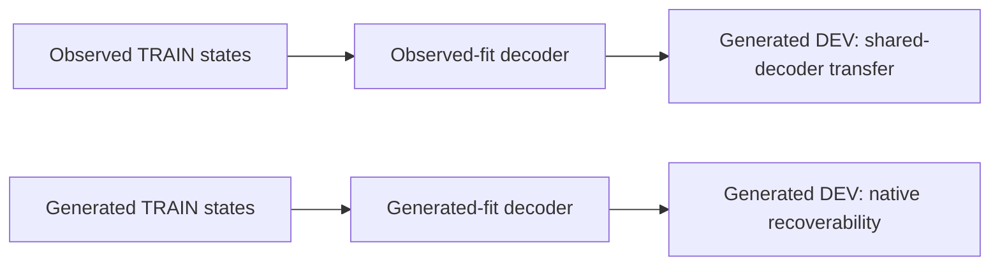

# M03 probe and coverage audit

Completed 2026-09-18. **All 12 binary labels missing from the completed M03 gate can be covered using existing support data.** The probe interpretation also needs repair: retain shared-decoder transfer, and add native generated-state recoverability. This is an audit and an address book, not a capability verdict or a gate rerun.

Machine-readable results: [audit.json](evidence/audit.json). Reusable exact addresses: [verified_root_index.json](evidence/verified_root_index.json).

## What the comment gets right

The completed reference is `artifacts/lewm_gates_20260906/m03_bootstrap/evaluation_v2`. Both published report hashes were checked against `complete.json`. The suite completed, but its decision remains `insufficient_coverage`, with M4 unauthorized. Replay and factual forks have zero pixel mismatch. The later `m03_matched` run is a separate, unsealed diagnostic with historical panels omitted; it does not supersede that reference.

The current outcome/successor evaluation fits on observed TRAIN successors and reads observed, generated and reset DEV successors through the same weights and TRAIN normalization. That is a valid shared-decoder transfer measurement. It does not establish information absence when transfer fails.

The [separate refit](../20260917_generated_readout/README.md) demonstrates the distinction. Consecutive TC death AUC moves from 0.4127 to 0.6957; root+action is 0.6828. The refit therefore changes the interpretation of poor transfer. It does not establish improvement over root+action, multi-step fidelity, or action selection. Its parents are the consecutive/strided TC pair; it is not a native refit of every historical panel or the later matched-10k worlds. Successor-state decoding also remains weak after refitting.

The full-simulator control is a flattened-state learner, not an established information ceiling. On exact961 death, linear full-state AUC is 0.4780 and MLP is 0.4335, versus linear pixels at 0.8339. A weak learner cannot establish absent simulator information. The main gate's own omission ledger still leaves the full capacity ladder, equal-capacity ceilings and memorisation controls incomplete.

Action-effect retrieval is independent of these fitted semantic decoders and remains useful evidence within its stated pixel-equivalence and root-coverage contract.

## Coverage: historical scarcity is not corpus scarcity

The reference gate has **116 missing entries, but only 12 distinct binary labels**. Those entries repeat labels across fit/evaluation, arms, probe families and successor conditions. Three crafting predicate pairs are identical: wood pickaxe/sword, stone pickaxe/sword, and iron pickaxe/sword. The missing crafting label is `make_stone_pickaxe` (prerequisites), rather than the continuous inventory count `stone_pickaxe`.

A read-only census of cached historical replay labels reproduces the remembered pattern. These counts are triage evidence, not fresh labels for a renewed gate. Historical FIT/TEST and support TRAIN/DEV are different protocols and must retain their original grouping.

| Missing label or identical predicate pair | Cached historical positive FIT/TEST seeds | Exact support positive TRAIN/DEV episodes retained |
|---|---:|---:|
| `front_water` | 71 / 17 | 10 / 10 |
| `front_tree` | 150 / 40 | 10 / 10 |
| `near_table` | 155 / 40 | 11 / 11 |
| `place_plant` | 225 / 58 | 10 / 10 |
| `make_wood_pickaxe`, `make_wood_sword` | 74 / 21 | 11 / 10 |
| `make_stone_pickaxe`, `make_stone_sword` | 13 / 1 | 11 / 10 |
| `make_iron_pickaxe`, `make_iron_sword` | 0 / 0 | 10 / 10 |
| `front_lava` | 13 / 6 | 10 / 10 |
| `front_ripe_plant` | 0 / 0 | 13 / 14 |

The support counts above describe the retained audit index, not an exhaustive corpus census. Exact static/successor counts and their independent episode units are in `audit.json`.

The exhaustive front-tile DEV census covers **all 930 eligible DEV episodes**, examining every logged pre-action time with a 64-frame prefix. It finds lava-facing states in **91 episodes**, ripe plants in **25**, water in **535**, and trees in **793**. TRAIN scanning stops after ten positive episodes per front-tile target: the 365 episodes scanned include 38 lava and ten ripe-plant episodes. TRAIN counts are lower bounds.

Crafting-event indexing supplies candidates, not certified prerequisites: other achievements can coincide with an action. Candidates were reconstructed with recorded reset/step keys and checked with the current `_state_binary_labels`. The combined index retains **129 roots across 50 TRAIN and 50 DEV episodes**. Every root and its factual successor reproduce stored pixels exactly, and all 17 successor actions use the recorded common key. For every missing label, the retained set has at least ten independent positive and negative episodes in each split for both root and successor coverage. The successor negative counts use a conservative lower bound: episodes whose tested root has no positive successor branch.

FINAL episodes are excluded. Raw shard hashes were not independently rechecked; the manifest hash, exact root/factual pixel checks and addresses are recorded. No encodings, probes, world updates, policy evaluation or promotion were performed.

## Recommended repair

1. Preserve the broad/terminal reference population and add an explicitly selected coverage panel. Choose final roots using labels, eligibility and a fixed selection seed, independently of arm scores. Keep sibling roots/actions grouped by their original episode/seed. Coverage-selected results describe a stress distribution.
2. Publish observed-fit transfer and generated-TRAIN-fit recoverability together for outcomes and rich successor state, including the combined recurrent state. Use paired comparisons to root+action, action-only and shuffled-action controls. Keep decoder normalization inside its TRAIN contract.
3. Validate structured, local simulator-state controls and a predeclared shared capacity ladder, including TRAIN fit checks and memorisation/shuffled-label controls. Interpret negative findings as failure of the declared readout protocol, not universal information absence.
4. Reuse compatible raw roots and features with byte/contract validation; encode only genuinely new or incompatible inputs. Publish a fresh manifest/report and preserve the original negative/incomplete evidence.

Existing data suffice for the current ten-episode binary coverage floor. They do not guarantee narrow confidence bounds or adequate within-root action-opportunity counts. In particular, only 25 eligible DEV episodes contain logged ripe-plant-facing states. Stronger power requirements may still require collection after the actual paired evaluation.

## Reproduction

The [scripts](scripts/) are model-free audit/reproduction helpers, invoked from the repository root with `PYTHONPATH=.` and `.venv/bin/python`. They write intermediate results under `/tmp`, leaving published gate artifacts unchanged. Run `build_candidate_index.py`, `verify_crafting.py`, `verify_remaining.py`, and `verify_expanded.py` in order; `front_tile_census.py` and `historical_census.py` are independent. The front census is cross-checked through the current gate label function and exact rendered replay on retained addresses. Historical cache access uses SQLite read-only mode.
