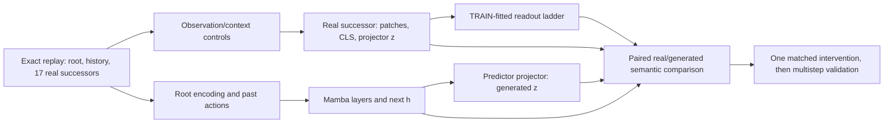

# Forwardable plan: localize counterfactual failure before selecting a repair

Goal: identify which measured failure belongs to observation/context, learned
encoding/export, readout fitting, learned dynamics, or recursive rollout. Produce
one controlled treatment with a decisive paired comparison. Keep Mamba as the
thesis architecture; Direct is a positive control, and the existing Transformer
comparison is supporting evidence. Scope is the present Craftax model, not a
claim about all JEPA representations.

## Established evidence and starting point

Read [README.md](README.md), [cached_readout_audit.json](cached_readout_audit.json),
and [action_input_screen.json](action_input_screen.json) first. Existing real
successor safe choices are Raw 14/36, TC 8/36, Direct 36/36, but Direct encodes
prefix+successor while LeWM encodes the successor alone. Raw movement-only AUC
is 0.567 against Direct 0.975. Dropping action inputs did not rescue LeWM in the
one-seed CPU screen. None of this establishes a representation ceiling.

## 0. Freeze the experiment contract and reuse valid work

Start from a fresh experiment directory and record git commit/status, source
closure, environment/kernel profile, checkpoints and their actual hashes,
dataset manifest, sidecar hashes, settings, PCA bases, and all interventions.
Cache immutable feature tensors and probe predictions; use atomic publication
and resumable stages. Reuse only after checking exact input bytes, preprocessing,
runtime/code identities, and branch alignment. A checkpoint or tensor shape is
not a compatibility proof.

Use these distinct lineages, with names that describe their actual treatments:

| Lineage | Role |
|---|---|
| `lewm_gates_20260906/m03_bootstrap/evaluation_v2` | Original jointly trained Mamba Raw/TC and native Direct controls |
| `lewm_transformer_comparison/m03` | Already trained source-exact comparison; do not retrain as the first treatment |
| `20260910_feature_ladder` | Existing frozen patch/CLS/z extraction and generic-state evidence |
| `20260918_matched_10k`, `lewm_gates_20260918/m03_matched` | Frozen consecutive-TC z→z / pooled-patch-PCA u→u; diagnostic, primary-only, not Raw/TC |
| `20260918_coverage_panel` | Declared rare-predicate stress distribution, separate from broad population evidence |
| `20260918_u2u_secondary/prep_record.json` | Prepared joint bare-CLS treatment on `u2u-secondary`; no training/evaluation result |

A single shared root ledger must identify episode/seed, split, root time,
incoming/outgoing actions, actual factual branch, common step key, and replay
pixel parity. Keep every root from an episode/seed together. Preserve original
historical FIT/TUNE/TEST grouping; do not relabel those records as support-v2
TRAIN/DEV. Deduplicate overlapping historical panels in uncertainty calculations.

Primary diagnostics use the existing broad panel and its 36 DEV safety
opportunities. Keep the 129-address rare-label panel separate. Count informative
TRAIN/DEV opportunity episodes per target, not 17 forks as independent samples.
Death, damage, reward, and crafting/state changes need separate opportunity
counts. Rare-predicate coverage alone does not provide safety-choice coverage.

Select hyperparameters and rungs on grouped inner TRAIN folds. Existing DEV
results are exploratory because they have already informed this plan. Before
confirming a treatment, lock an unused-episode evaluation panel using declared
simulator predicates and a deterministic address ordering. Target at least 100
independent death-opportunity episodes if the existing corpus supports it; record
the attainable count and a fixed search cap before model scoring. If a required
target cannot attain the precision target, report that limitation rather than
cycling through thresholds. Keep FINAL sealed for the eventual gate confirmation.

## 1. Validate the measurement with frozen features

Question: can the representation be read adequately under a protocol designed
for the within-root decision? This step trains only readouts, not world models.

Reproduce the published 200-step linear/128-MLP fits and the CPU screen. Then
predeclare three readout families: regularized logistic regression, MLP-128,
and a two-layer MLP-512. For high-dimensional spatial features, also use a small
position-aware token readout; separately compare dimension-matched PCA-192 and
report parameter counts. Equal hidden width is not equal parameter capacity.

First compare two fitting objectives on current Raw/TC z and native Direct,
using the same TRAIN labels and inputs: ordinary death BCE and within-root
safe/fatal pair ranking.
For the latter, use `softplus(score_safe - score_fatal)`, average pairs within a
root, then average roots, so each root contributes equally. Use all 17 actions.
Report ordinary six-target BCE as the original-protocol anchor. This separates
decision-objective mismatch from representation changes; pair supervision is a
diagnostic readout treatment, not neutral unsupervised world-model training.

Bound this stage: three arms × three readout families × two objectives × three
seeds = 54 successor-only fits, plus the original cached protocol anchors.
Evaluate explicit action input for the selected family and retain action/root
controls. Freeze the adequate readout protocol on inner TRAIN before running
the encoder ladder. Do not cross every optimizer, head, objective, context,
checkpoint, and rung. Benchmark feature extraction and a representative probe
fit first, report cold/warm/cache timings, and set the resource budget from those
measurements. Escalate optimization only when convergence checks justify it.

Use three fixed probe seeds. Tune regularization and optimization only on inner
TRAIN folds. Verify training fit, validation learning curves, and a declared
optimization budget; 200 steps does not itself establish convergence. Run root-
grouped label-permutation/memorization controls for larger heads, and record
TRAIN versus held-out performance. A high-capacity success establishes usable
readout under that supervision; a finite failure remains a lower bound on what
was recoverable by the tested family.

For death, score both successor-only and successor+action heads. For transition
targets such as damage/inventory change, compare root+successor against the
matched root+generated-successor input. Add `[root, successor-root]` as a declared
alternative; preserve root state because a delta alone can discard necessary
absolute risk. Separate visible local tile changes from whole-map privileged
labels. Do not silently substitute one target for the other in the old report.

Controls must include uniform action selection, TRAIN-chosen constant action,
fitted action-only, matched root+action, and matched encoded-root-history+action.
Add persistence and shuffled-history/action controls to the generated comparisons.
The history baseline must receive the same causal observations/actions and
comparable decoder capacity as the model feature being assessed.

Positive controls:

* Exact successor simulator death predicate, checked against all branch labels.
  This is label/replay sanity, not a learned-representation score.
* Structured successor state readout, using health and relevant local/player
  map information, versus the prior flattened prestate learner.
* Real successor pixel readout, including HUD and local spatial crops; compare
  single-image and causal history+successor inputs. Verify which labels are
  actually observable. Simulator-wide changes can require unavailable information.
* Native Direct prefix+successor encoding. Short-prefix Direct is a separately
  labeled intervention with possible distribution shift, not its replacement.

Do not claim information absence if pixel/structured readouts also fail, positive
controls are unresolved, or optimization has not been adequate. If a stronger
readout repairs current z, keep that result and test its generated counterpart
before choosing architecture retraining.

## 2. Run the real-successor encoder/export ladder

Extract all taps in one eval-mode frozen pass where practical, including roots
and all real successors. Freeze BN statistics and dropout. Reproduce cached CLS/z
under the declared FP32 parity profile; hook transformer output after the final
LayerNorm, and distinguish pre-normalization intermediate layers. Never infer
parity from shape alone.

For both original jointly trained Raw and TC, use the same rows/readout protocol:

1. Raw successor pixels and structured state controls.
2. Full final 9×9×192 patch grid, with positions retained.
3. 4×4 pooled grid, 2×2 pooled grid, and patch mean.
4. TRAIN-fitted PCA-192 of full patches and of the pooled grid, separately named.
5. The **exact saved basis** and pooled-grid preprocessing of old u, evaluated
   on its own frozen-encoder lineage alongside that lineage's CLS/z.
6. CLS-192.
7. Encoder projector: first linear output, BN output, GELU output, final z-192.
8. Direct native full-1024 and TRAIN-fitted PCA-192.

Extract inexpensive taps together, but score a minimal first pass: z, CLS,
full-patch PCA-192, pooled-patch PCA-192, and the existing Direct controls with
linear plus the readout selected in phase 1. Evaluate exact old u on its separate
lineage. Expand to full-token, pooling-scale, and projector-intermediate heads
only to resolve a specific remaining gap. Intermediate ViT layers and checkpoint
time curves are conditional follow-ups, not another full cross-product.

The old full-grid PCA rung and old pooled-grid u are different representations.
Fit unsupervised reducers within inner TRAIN during selection and refit on all
TRAIN after freezing the chosen protocol. Save every basis and preprocessing
contract. Larger-dimensional rungs need explicit probe-capacity controls; PCA
success/failure does not establish a dimensionality theorem.

Test matched available context by concatenating causally encoded frames/features
from the same prefix, plus known past actions where appropriate. A framewise
LeWM encoder does not gain temporal processing merely by being called on 64
images. Compare single successor versus root+successor and short causal histories
using adequate temporal readouts. The goal is to distinguish missing context from
a spatial/export problem without redefining Direct's native encoder.

Only if a material gap is found, inspect ViT embedding output and layers 3/6/9/12,
with patch and CLS taps under the same normalization/readout controls. Inspect
available 2k and 10k checkpoints on the same frozen panel, and initialization if
the exact checkpoint exists. These curves locate emergence of the measured
problem; they do not alone prove that SIGReg or joint learning caused it.

## 3. Cross the viable real-state rungs with learned dynamics

Evaluate the existing z→z and u→u worlds before training replacements. Obtain
real-u and generated-u safe choice with both native-fit and transfer-fit readouts.
For original joint Raw/TC, tap pair/action projection, selected Mamba blocks,
next h, and predictor linear/BN/GELU/final generated z. Use causal branch state
after `(root latent, proposed action)`, before observing the future. Include
native-fit h and `[generated z,h]`; the final state interface includes memory,
and a z-only score need not exhaust its capability. The current frozen random
agent readout is not a trained semantic oracle.

For each viable state rung, preserve the four-condition table:

| Decoder fit | Evaluation | Question |
|---|---|---|
| Real TRAIN states | Real held-out states | Observed-state readout adequacy |
| Real TRAIN states | Generated held-out states | Shared-decoder transfer / semantic compatibility |
| Generated TRAIN states | Generated held-out states | Native generated-state usefulness |
| Generated TRAIN states | Real held-out states | Cross-distribution transfer, not a test excluding rotations |

Compare every generated result with its own root/history+action control using
the same paired episodes. Recoverability after generated fitting is not sufficient
for a usable world model if it adds no decision skill over those controls.

Measure action-centered deltas, paired cosine/alignment/error, and action-effect
retrieval as supporting evidence. Test action permutations: spread magnitude can
remain unchanged while action assignments are wrong. If both in-domain readouts
are good but transfer alone is poor, try one TRAIN-paired affine/orthogonal
alignment control and test held-out choice. Do not use cross-back failure alone
to rule out a coordinate mismatch.

## 4. Select one controlled retraining branch

Choose from the following evidence, not generic-state macro averages:

| Reproducible result | Bounded next treatment |
|---|---|
| Current z works with adequate readout, generated z also adds skill | Implement/calibrate that readout and retain explicit transfer metrics; architecture retraining is not yet justified |
| CLS materially beats z on the actual safety metric | Matched z→z versus bare-CLS training, with source/evaluation lineage repaired before launch |
| Patches or exact old u beat CLS/z on real safety choice | Train Mamba on the demonstrated viable spatial export, first with frozen encoder |
| Real u is good, generated u is poor | Diagnose predictor/objective/action alignment using the existing u world; generic-state improvement was insufficient |
| h or `[z,h]` adds skill while generated z alone fails | Test predictor export/readout treatment with frozen encoder and matched dynamics |
| Single-frame pixels/features fail but causal-history readouts work | Matched context/memory treatment; distinguish encoder memory from predictor history |
| Patches remain poor under adequate controls while pixels work | Retrain encoder/objective; projector-only changes have weak support |
| One-step is good but recursion is poor | Matched rollout-aware predictor training and teacher-forced versus recursive tests |

For a spatial branch, start with one compact representation that already passes
the real-state diagnostic. If PCA-192 works, keep 192-D and the existing Mamba
dimensions for the first target/input intervention. If only a spatial grid works,
retain ordered slots with a per-frame adapter or spatial head; do not flatten
space into the temporal recurrence as extra environment timesteps. Separate
spatial structure from total width with a matched compressed/vector control.

First train a matched frozen-encoder baseline and one treatment: same sampled
windows, initialization scheme, optimizer, LR schedule, batch order, regularizer
choice, action/context contract, updates, and diagnostics. Reuse an old baseline
only if these contracts genuinely match. This isolates the viable export/input
intervention from changing the encoder objective. If successful, repeat across
three fixed model seeds, then test joint versus frozen encoders under matched
sampling and initialization. Treat that as a subsequent intervention.

If objective/encoder learning is implicated, compare the unchanged objective
against one retention treatment chosen from the diagnosed target: visible-state
or spatial reconstruction, or action-effect supervision. Declare its additional
supervision, weight, and matched controls; do not change width, context, loss,
and data simultaneously. A supervised pixel-to-outcome/feature head is an
attainability control, not evidence for reward-free world-model training.

The prepared joint bare-CLS branch currently has an explicit evaluation gap:
G1/M03 would still extract z through its unused projector. Repair extraction,
checkpoint identity, runtime closure, frozen-eval proof, and regression failures
before using that branch. It is a useful projector intervention only if the
real CLS-versus-z contrast supports it; it is not the old patch-PCA u treatment.

## 5. Validate broader world-model usefulness and stop

Primary metrics are 17-action safe-choice rate and paired lift over the strongest
matched causal baseline. Also report macro within-root death AUC, movement-only
safe/fatal AUC, fatal-safe margins, action-specific calibration/error, selected
action histograms, opportunity episodes, and intervals. Movement-only scores
diagnose direction but cannot replace the original action set. Damage/reward/
state-effect choices and generic state probes are separately reported targets.

Use the same episode/seed clusters in both conditions of every paired bootstrap.
Report three probe/model seeds separately and their stability; do not multiply
roots into 17 independent samples or treat seeds as extra episodes. Predeclare
primary contrasts and a practically meaningful improvement (default proposal:
10 percentage points safe-choice lift), with family-adjusted inference or an
untouched confirmation panel after exploratory rung selection. A non-significant
difference is not equivalence. If precision is inadequate, expand the locked
episode panel under its fixed sampling rule rather than training more variants.

Then compare teacher-forced and recursive predictions at horizons 1, 2, 4, 8,
16, using common action suffixes and explicit reset/BOS semantics. Condition on
matched causal history, include held-out action sequences, report survival and
state/event effects, and quantify stochastic outcomes with multiple common keys
when relevant. Use a declared simulator rollout planner with the same objective
and action search budget as a positive control. Add one bounded closed-loop
MPC evaluation with frozen readouts; assess actor/critic learning separately.
One-step death choice alone does not certify achievements or long-horizon control.

Early screen: one paired model seed, existing 2k screen point, then 10k if the
predeclared diagnostic contrast remains viable. Use TRAIN/inner-validation fit
and representation/dynamics checks for stopping; existing 36-root DEV has weak
precision for small differences. Do not select interventions by repeated DEV
peeking. Record failed/stopped runs and stop reasons. Confirm a promising result
with three seeds and the locked unused-episode panel before broader gate work.

Deliverables per phase: input/hash manifest; immutable feature/prediction cache;
per-root/action failure ledger and counts; learning curves; paired metric table;
one statement distinguishing measured location from unproved cause; and the
single next intervention justified by that evidence. If no viable real-state rung
is found within the declared readout budget, stop with that bounded negative
result and choose the encoder-learning branch, rather than beginning a width/
backend sweep. Any final improvement must be evaluated with explicit primary,
historical, coverage, transfer, and multistep scope before M4 review.
