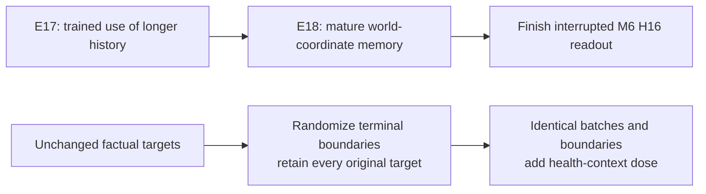

# October 5 recovery and separating health audit

The upper line is the live queue. The lower comparison is a candidate health diagnosis, not a launched run.

## Recovery facts

No new completed performance report was found after the preceding audit. A16 s7/s8 6k worlds are preserved. Canvas
s7's full state is 13k / 36k and archived. M16 had no full-run checkpoint and restarted from its own 36k parent, never
the 500-step smoke. It saved at 1k and 2k, and reached 2.5k at 10:22 AEDT. The 2k state was decoded, checked and archived.
Its fresh-start loss at 500 is 0.06193946 versus the discarded
run's 0.06049695; no claim of recovering those weights or isolating the cause of this difference is made. Inputs and
parents match pinned hashes. Loss history is optimization evidence, not semantic performance.

Actual canvas CUDA resume check (4 uninterrupted vs 2+2 updates from 13k): parameter difference 0, optimizer difference
9.09e-12, all RNG streams equal. Short measured equivalence under 1e-6, not long-run bitwise determinism. 227 files are
pinned; all three dataset hashes match historical manifests, including 39.39 GB Raw-long tokens. The dataset/source
record is external; historical states themselves did not seal their inputs.

M16+desktop uses ~3,599 MiB, leaving ~2,251 MiB, below canvas admission 2,556 MiB. E18 waits for E17's lane to finish.
H16 memory shrinks during head fitting then grows again within one process; the serialization prevents admitting a
trainer in that gap. Only a waiting scheduler was restarted. M6 s8 H16 follows these lanes with resumable caches and a
separate report directory; its unjournalled legacy partial is retained, never reused. Seed7's legacy report is kept.

## Actual TRAIN counts

`audit_health_design.py` reconstructs 30,599 training windows after the exact 2,048 held-out main rows.

| Property | Count |
|---|---:|
| Terminal windows |8,071|
| Alive-input targets |152,995|
| Actual deaths by predictor input row 0..4 |**0,0,0,0,8,149**|
| Ordinary ≥2 damage, living successor |2,000/144,846 (1.3808%)|
| Ordinary damage covered by zombie-context mask |1,636/2,000 (81.8%)|
| Ordinary damage among masked living successors |1,636/23,664 (6.9135%)|
| Ordinary damage outside mask |364/121,182 (0.3004%)|

The old 78% statistic concerns health drops, not actual deaths. Every actual death is at the final row, including
natural terminal main windows. This proves a label/row association. Previous fixed-frame/row and repeated-current-
frame interventions prove dependence in the trained models; neither measures a de-alignment retrain's improvement.

The stored mask is independently rebuilt from the exact TRAIN-seed ridge (229,474 FIT / 57,755 validation cells):
**zero disagreements over 163,235 labels**. Source/input pins: `health_mask.json`. Renderer.py:498–507 confirms the
health icon and overlaid number are both in HUD cell(0,0), patch 63. Contextual tokens may carry health elsewhere too.

## E19 confound caught before launch

Enumerating all five offsets of the proposed terminal crop/right-pad transformation gives:

| Quantity | Existing | Candidate expectation |
|---|---:|---:|
| Valid targets |152,995|136,853 (**−10.5507%**)|
| Ordinary damage targets |2,000|1,636.6 (**−18.1700%**)|
| Death prevalence per target |5.3263%|5.9546%|

This changes exposure and normalization as well as boundaries. A target-preserving candidate instead predicts both
the original prefix and the terminal suffix beginning at frame 4−r, r uniform 0..4. All five factual action/target pairs
remain, normalized by their original coordinate count. CPU checks on the actual A6 parent: no-split loss/gradient
difference 0; future-padding prediction difference2.47e-6; pair/action identities preserved at every offset.
This still changes some context lengths/resets, so call it boundary/layout randomization, not positional embeddings
alone. Mamba CUDA layout validation and the full matched trainer remain pending; no E19 training launched.

On the entire actual TRAIN pool, hp1 multiplies selected health-token coordinates by ~400.18 (minibatch factors vary).
Weighted ≥2-drop label prevalence among health targets becomes 24.19% vs 5.38%, including deaths. This is an objective
measure, not a predicted/conditional hit probability. The mask misses 18.2% of ordinary ≥2 drops and many starvation/
recovery cases. Keep matched negatives, conditional calibration and false-hit checks. C must share B's batches,
boundaries, masks and denominator. A generic stochastic-prior replica cannot repair E16's true-future decoder failure.

## Primary literature checked online

- [Delta-IRIS](https://arxiv.org/html/2406.19320v1), appendix B / table 7: removing max-pixel improves average L2
  0.000185→0.000178 but worsens worst-pixel 0.018→0.031. Local failure can hide under improved averages. Its pixel loss
  is different from our latent L1; this motivates a separating loss contrast, not its coefficient or a proved cause here.
- [Po et al.](https://arxiv.org/html/2505.20171v1), §5.4/table5: block-size 1 SSIM 0.766 versus full 0.855; removing their
  long-training adjustment gives 0.809. They cannot effectively retain beyond trained context. Finish E17 with attention
  controls; fmamba is related to their block-size 1 ablation, not their entire diffusion model.
- [Rudy & Sapsis](https://arxiv.org/pdf/2112.00825), §2.2/§3: tail weighting can overpredict rare events when false
  positives are underpenalized. Their adjusted objective addresses this. Relevant to our positive-only dose failures,
  but an LSTM/MSE study, not evidence for hp1 or calibrated stochastic imagination.
- [VaGraM](https://arxiv.org/abs/2204.01464): reconstruction and control objectives differ; practical value-aware
  training needs stability. Hand-labelled HP masking is a diagnostic proxy, not their value-gradient method.
- [TrajGRU](https://arxiv.org/abs/1706.03458): location-varying recurrent connections support E18's registration
  question, without proving correct transport/absence handling of our two Mamba carries.
- [Terver et al.](https://arxiv.org/html/2512.24497v1): two-step rollout helps their simulation planning, more can
  hurt; DROID prefers six. Deployment context matters; the earlier negative rollout recipe is not a universal result.

These are rationale and sanity checks. They do not supply causal attribution for project failures. E17/E18 measure
context use/registration, separately from health reconstruction. No repaired canonical Raw/TC or actor result exists.
