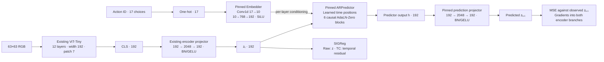

# Source-exact LeWM predictor comparison — implementation plan

Plan only, audited against `94312ea2` on 2026-09-18. No backend implementation or research training was launched. Mamba remains the thesis architecture; this is a diagnostic comparison.

## 1. What this comparison means

Jointly train the existing Craftax CLS encoder with the **actual pinned base-LeWM predictor package**, once with Raw SIGReg and once with TC SIGReg. Keep our native observations, one-step task, dataset, statistical batch, optimizer schedule, training budget and semantic evaluation. Do not run another frozen-encoder `z/u` experiment.

The executable reference is `third_party/sources/lucas-maes__le-wm`, commit `8edfeb336732b5f3ce7b8b210d0ba370a09e2cac`. In particular:

- [`module.py`](../../../third_party/sources/lucas-maes__le-wm/module.py): `Embedder`, `ARPredictor`, `ConditionalBlock`, `Attention`, `FeedForward`, `Transformer`, `MLP`.
- [`config/train/model/lewm.yaml`](../../../third_party/sources/lucas-maes__le-wm/config/train/model/lewm.yaml): constructor arguments.
- [`jepa.py`](../../../third_party/sources/lucas-maes__le-wm/jepa.py): `predict` and sliding-window autoregressive `rollout`.
- [`train.py`](../../../third_party/sources/lucas-maes__le-wm/train.py): aligned prediction loss without target stop-gradient.

Audited SHA256: `module.py` = `0b258a9e8dc24c29fcb1e8c50a09ec78b8ea85aeb79e21dd8adf712396646620`; `jepa.py` = `41bad7fd21e0f14aea4c9c3d39a9c87037e787746d953ab62cdc0677e938ce96`; constructor YAML = `7be97eaa2c83f809b9ea7a6da5a7d3f3c70502c27537383f54db32335e21e42b`.

This is a **source-exact predictor in our adapted experiment**, not a claim to reproduce the complete robotics system or TC-v2's different architecture. Craftax's discrete action conversion and native image geometry remain explicit domain adaptations. TC centering remains our paper-derived variant over base LeWM; it is not misrepresented as vendored TC code.

## 2. Components and exact constructor contract



| Element | Required value/behavior |
| --- | --- |
| Predictor input / hidden / output | `192 / 192 / 192`; no Mamba-style pair projection |
| Depth / heads / head dimension | `6 / 16 / 64`: **attention inner width 1024**, QKV weight shape `[3072,192]` |
| Feed-forward width | `2048`, GELU, source's internal LayerNorm |
| Positions | `num_frames=3`; source `torch.randn(1,3,192)` initialization, added before predictor |
| Dropout | Block/attention/MLP `0.1`; embedding `0.0`; eval disables dropout |
| Action encoder | Source `Embedder(input_dim=17, smoothed_dim=10, emb_dim=192, mlp_scale=4)` on unnormalized one-hot IDs |
| AdaLN | SiLU → biased Linear `192→1152`; final weight **and** bias initialized to zero |
| Normalization | Preserve outer non-affine LayerNorm `eps=1e-6`, inner affine LayerNorm defaults, and final affine LayerNorm. Do not remove the apparently duplicated norms. |
| Prediction projector | Source `MLP(192,2048,192,norm_fn=nn.BatchNorm1d)`; flatten `[B,3,192]` to `[B*3,192]` once during training |
| Source init | Instantiate pinned classes directly. No blanket ViT/HF initializer applied to the predictor. |
| Encoder | Existing `LeWMEncoder`, including preprocessing, CLS selection, interpolation flag, projector and BN defaults |
| Objective | Existing `joint_loss`: prediction MSE + `0.09 * SIGReg`; Raw/TC difference only centering; no EMA, reconstruction, labels, patches, `u`, whitening or new loss |

Verified CPU parameter counts: ARPredictor **10,791,360**, action encoder **156,276**, prediction projector **792,768**; trainable predictor package **11,740,404**. Current Mamba world has **2,388,040 trainable parameters**. This control changes the upstream predictor package, including capacity (~4.9×), conditioning, normalization, positions and dropout. It cannot by itself isolate the sequence mixer.

## 3. State and rollout: preserve upstream behavior, not Mamba mechanics

Introduce `WindowPredictiveState` alongside the untouched Mamba `PredictiveState`:

| Field | Meaning |
| --- | --- |
| `latent` | Current accepted `[B,1,1,192]` state |
| `past_latents` | At most **two** completed pair inputs, excluding current latent |
| `past_actions` | Corresponding outgoing int64 action IDs; no BOS/padding |
| `history` | Last completed pair's predictor output, `[B,1,192]`; zero at reset |
| `step` | Number of accepted transitions since start; advances exactly once |

For `advance`, append `(current z, chosen action)` to buffered completed pairs, call the source action encoder and predictor on the last **three pairs**, apply the source prediction projector, retain the last two pairs, accept the last predicted `z`. Position indices are reset to `0:window_length` on every source call, exactly as `JEPA.rollout` does. Never maintain an unbounded context or extrapolate the three position parameters.

`observe_latent` executes the same transition, then substitutes the true successor only for `latent`. Observed and generated branches therefore share exactly the same `h_next`. `h_root` never includes the candidate outgoing action.

Training `teacher` on four frames executes one parallel source call on the three input/action pairs. Both BN projectors see their complete declared flattened batches, encoder `B*4`, predictor `B*3`. Streaming is eval-only with frozen BN statistics. Eval teacher scans longer than three pairs use rolling source windows, not a length-64 forward through a length-3 position table. Chunked continuation must reproduce this bounded-window reference, including position resets.

For final-state-only eval `prefill`, directly evaluate the last up-to-three **completed** pairs, retain the last two, and accept the true final observation. This is exact and avoids rescanning all 64 pairs. For full per-step eval outputs, batch/group overlapping windows by actual length 1/2/3; never mix padding into the source model.

Do **not** add an ordinary persistent KV cache. When the window slides, positions change and remaining keys/values contain indirect dependencies on evicted tokens. Dropping the oldest KV entry is not equivalent to recomputing the source window.

All state operations clone/fork/repeat/detach every buffer explicitly. Repetition is root-major across all 17 actions. Separate state types prevent accidental use of Mamba carries or legacy current-frame-inclusive memory.

Retain the existing untrained/frozen readout API as a local compatibility shim, with 256-dimensional feature output; it is not part of the source predictor, does not feed prediction, and does not enable M4. Semantic memory probes bypass it as they already do.

## 4. Exact integration map

These are bounded changes to the shared runtime, not a replacement training/evaluation framework.

| File | Required change |
| --- | --- |
| **New `d4mj/lewm_transformer.py`** | Hash-checked, namespaced import of the pinned `module.py`; instantiate `Embedder`, `ARPredictor` and `MLP`. Implement `LeWMTransformerWorld` teacher/window transition, validation, source hidden output, fixed-BN guard, compatibility readout and bounded prefill. Do not edit vendor files or import generic `module` via global `sys.path`. |
| `d4mj/lewm_config.py` | Add `TransformerDynamicsSettings` and a `LeWMTransformerConfig` subclass of `LeWMConfig`, new explicit `family=lewm_transformer`, schema v3. Keep old dataclasses/defaults unchanged. Transformer settings: width192, depth6, actions17, context3, heads16, head_dim64, mlp2048, dropout.1, embedding_dropout0, action_smoothed_dim10, action_mlp_scale4, backend `sdpa`, compatibility readout width256. Split validation: common encoder/joint/runtime vs backend-specific settings. Research validation seals the source constructor values and one-step `stride=1`; no Mamba headdim/state/kernel checks on Transformer. Small verification fixtures may reduce dimensions. |
| `d4mj/config.py` | Dispatch the new family to its typed config parser. Serialize/digest it canonically. Existing v1/v2 recipe dicts and recorded digests must remain byte-identical; do not add default backend fields to old recipes. Keep unknown/mixed settings rejected. |
| `d4mj/state.py` | Add the immutable window state above; retain all existing state definitions and timing semantics. |
| `d4mj/world_api.py` | Dispatch construction/type validation to the correct world and adapter. Add `LeWMTransformerWorldAdapter` implementing all `WorldAPI` methods, including state tensor enumeration. Backend/device inference overrides must be explicit: never force `triton/reference` onto Transformer. Keep encoder construction first so same-seed starting encoder weights match Mamba. `require_control` remains blocked. |
| `d4mj/lewm.py` | Keep encoder and objective behavior unchanged. Only generalize world/state typing where needed; no conditional loss recipe or patches introduced. |
| `d4mj/train.py` | Use shared `train_joint`, optimizer groups, schedule, full batch and phase mode. Seed a **Transformer-specific saved global CPU/CUDA dropout stream** before saving step0 or starting a fresh run; reset identically for Raw/TC independently of preflight/launch order. Mamba's existing no-dropout trajectory must not change. Existing checkpoints already save/restore global CPU/CUDA RNG: extend tests, do not add a redundant RNG format. Keep sampler and SIGReg generators separate. |
| `d4mj/checkpoint.py` | Pass config into backend-aware source validation; strict-load the appropriate module shapes and state dict keys. Retain immutable snapshots, scheduler/data checks, BN state, optimizer state, CPU/CUDA RNG and `m4_authorized=false`. v2 bundle container is sufficient because config/source identities discriminate backend. Reject cross-backend training resume. |
| `d4mj/sources.py` | Backend-aware manifest/verification, default call preserving Mamba behavior. Transformer closure includes the actual imported pinned module, constructor YAML, new wrapper, shared runtime, HF implementation, dependency/runtime versions and execution settings; verify file hashes, not just Git HEAD. Do not require imported Mamba kernels for a Transformer-only world. Propagate config at every manifest caller. Preserve the upstream LICENSE. |
| `d4mj/gates.py` | Config-aware source checks in `require_joint_gates` and `require_joint_screen`. Preserve required component names and phase boundaries; dispatch the implementation of the recurrence/mechanics check, not semantic thresholds. |
| `d4mj/lewm_diagnostics.py` | Add independent source predictor/window audit and dispatch recurrence/resource checks. Remove unconditional use of `.layers[0].mixer`, `.pair_projection`, conv/SSM gradients, Triton profile and remote-old-context influence **only for Transformer**. Resource gradients check predictor projector/AdaLN at init, and action/attention gradients after gates have updated. G1 continues using the same windows, retention probes, initial-vs-trained progress and Raw/TC contrast. Include backend/parameter/context metadata in reports. |
| `d4mj/experiments.py` | Accept typed new recipes in preflight, paired-run, joint/resume/export. Extend kernel `--backend` handling to `sdpa` with family validation; default backend-aware device mapping. Record comparison-only scope and actual backend in pair/baseline manifests. Raw/TC Transformer pair must have identical initial weights, sampler, schedule and dropout RNG; do not pretend Transformer-vs-Mamba is a single-parameter recipe pair. |
| `d4mj/cache.py` | Accept new-family latent exports. Make new encoder identity truthful (framewise LeWM encoder, with weights/settings/source/runtime) rather than stamping Transformer exports `lewm_mamba`; preserve old identity scheme for old caches. Parent checkpoint + encoder weights remain pinned; never reuse Mamba observed latents for a newly jointly trained Transformer encoder. |
| `d4mj/m03/gate.py` | Backend-aware `load_m03_bundle`, source/IEEE checks and execution overrides; retain completion/dataset checks. `_encode_lewm` remains the common z/CLS/observed/generated/reset extraction via `WorldAPI`. Include new wrapper in Transformer feature dependencies and backend/context/parameter metadata in parents/reports, without changing Direct parent identities. Keep scoring functions and fixed settings unchanged. |
| `d4mj/m03/diagnostics.py` | Dispatch carry summaries: Mamba conv/SSM unchanged; Transformer reports window length/buffer norms under explicit new diagnostic metadata, not fake SSM values. Reuse the same z/h/joint semantic tasks and controls. Pad **only probe h inputs** from native192 to256 with zeros so `[z,h]` has448 dimensions like Mamba; no learned projection, no change to native predictor h. Add effective context/native h width to reports. Normal c4/c16/c64 results must saturate for the finite-window backend; shuffling may move older pairs into the active window and is still a valid intervention. |
| `d4mj/m03/history.py` | Route all checkpoint loads/source identities to the new backend; adapt `run_memory` source verification for explicitly proven donor reuse if supporting memory-first after shared-file edits. Preserve address membership, true short BOS lengths, replay labels, source checks, panel splits and all five memory panels. No new fork convention. |
| `d4mj/m03/cache.py` | Normally retain dependency/statistics algorithms. If `prepare_imports` is extended to modern donors, require explicit per-node identities/hash verification; never unconditional import based on path/shape. Modern donors already use the shared SQLite dependency cache, so do not require retired-evaluator migration to get ordinary reuse. |
| `d4mj/m03/feature_cache_compat.json` | Regenerate a measured hash-pinned bridge for unchanged replay/Direct execution after shared `config/state/world_api` edits. Preserve valid prior generations needed by the donor, fail closed on subsequent edits, and exclude new Transformer features. Current record pins only earlier config/data changes and will not suffice unchanged. If the donor contains multiple proven generations, extend `_feature_compatibility/_feature_compatible` to accept explicit verified prior **runtime mappings** (backward-compatible with v1), not arbitrary Cartesian combinations or one prior hash that silently loses older reuse. |
| `d4mj/m03/frozen_eval_compat.json` / proof tooling | Old checkpoint source closures change when shared files change. If loading old Mamba worlds in the new tree, regenerate proofs for exact checkpoint SHA + recorded/current source manifests and frozen encoding/transition surface. Keep training resume strict; no blanket source waiver. The current loader supports proof arguments/automatic record; **the main CLI currently does not expose the README's `--frozen-eval-proof` flag**. Wire explicit proofs through primary/history/memory if adding that flag. |
| **New recipes** `d4mj/recipes/lewm_transformer_raw.json`, `lewm_transformer_tc.json` | Copy the original Raw/TC recipes' encoder/joint/runtime/seed; replace only family/schema/dynamics with the exact package. Native stride1, consecutive centering, full10k schedule, screen2k. Do not copy v2robotics or stride4 macro dynamics. |
| `d4mj/m03/README.md`, `d4mj/spec/lewm/{README,INTEGRATION,STATUS}.md` | Document comparison backend, exact/adapted boundary, finite-window state, all-gate command, proof mechanisms, source provenance and package-capacity confound. Do not rewrite historical Mamba findings. |
| `d4mj/tests/*` | Add source-exact backend tests and parameterize shared integration tests; specific acceptance matrix below. Existing Mamba, legacy, stride/centering and cache tests remain active. |

**Verify-only / no algorithm edits:** `data.py` sampler and corpus, `execution.py`, `imagination.py`, legacy `representation.py`, `transition.py`, `time_mixer.py`, agent/head/actor/render losses and `__main__.py` dispatcher. New config subclass keeps current joint-family checks usable. LeWM live control remains intentionally unavailable; “same gates” does not authorize policy/actor implementation.

## 5. Reuse exactly what is expensive

Verified complete donor: `artifacts/lewm_gates_20260906/m03_bootstrap/evaluation_v2/`, containing **638 historical replay shards** and a combined report. The parent `m03_bootstrap/` is not the run directory. Use shared `artifacts/lewm_gates_20260906/cache.sqlite3`.

The new Transformer encoder/world changes checkpoint identity, so its encodings and affected semantic probes must be computed. It does **not** logically change replay/simulator labels, Direct checkpoints, Direct encodings or Direct-only fitted statistics.

However, existing dependency keys include whole runtime file hashes. Adding config/API/state dispatch changes those keys even when the Direct path is unchanged. Reuse needs three distinct mechanisms:

1. **Frozen checkpoint proof:** permits evaluation of an old Mamba checkpoint after a measured shared-source delta; never permits training resume or substituted Transformer weights.
2. **Feature dependency bridge:** prior/current runtime hashes plus measured unchanged replay/Direct behavior, retaining extraction-function identity. This is what addresses changed config/API/state files.
3. **`--cache-compatibility`:** hash-pinned equivalence of changed *statistics functions*. The existing bootstrap proof is not a universal architecture compatibility switch. Keep scorer functions unchanged when possible; regenerate proof only for genuinely equivalent changed functions. Never declare different Transformer memory extraction equivalent to Mamba extraction.

Validate a fresh-directory reuse smoke **before** the research gate. Require zero computation of historical replay and Direct feature nodes, including both anchors; acceptable new computation is Transformer features/probes, changed diagnostic summaries and new cross-backend paired statistics. Donor counts, manifests, roots/settings/splits and checksums must match. Verify cold/warm timings and `cache_usage.json`, not just a reported cache hit. Also prevent unnecessary legacy-policy construction when historical replay nodes already exist in SQLite; `run_history` currently checks the new run's local shard path before constructing `_policy`, which alone does not establish a cache miss.

Do not resume a sealed old output under edited evaluator code. Use a fresh output, immutable checkpoint/data inputs and the shared cache. Same-output resume works only under the same newly sealed contract. Proofs are produced after code freezes, before preflight and research runs.

## 6. Optimizations that preserve the reference

- Import the vendor module once per process; no Hydra/Lightning/stable-worldmodel trainer dependency is required for these standalone classes.
- Keep source `scaled_dot_product_attention(is_causal=True, dropout_p=...)` and its CUDA dispatch; no manual attention, qkv layout changes or smaller head count. Measure actual selected kernels with training dropout; do not promise FlashAttention from BF16 alone.
- Existing BF16 autocast for encoder/predictor, FP32 prediction-loss/SIGReg reductions and IEEE/TF32 settings remain sealed. Verification FP32 oracle checks are separate from BF16 numerical tolerances.
- Existing non-reentrant ViT block checkpointing remains. Do not checkpoint a BN projector (would update statistics twice). If predictor checkpointing is needed for the actual batch128 resource limit, wrap only pure blocks, preserve dropout RNG, and add source forward/backward/update parity tests before use.
- Training teacher pass remains parallel over three pairs, not a Python recurrent loop.
- Eval prefill uses a bounded final source window; batch all17 candidate actions and overlap-window eval where full history outputs are needed. Keep BN eval, no gradients and one world on GPU at a time.
- Do not cache encoder latents across **joint** training updates. Shared replay/Direct caching, not a frozen encoder shortcut, is the principal safe compute saving.
- Compile/fused-optimizer changes are not required in the initial backend. Add only if a measured bottleneck warrants them and parity/RNG/resume tests certify the execution profile. Report actual warm seconds/update and peak allocated/reserved memory on the target GPU; no extrapolated runtime promise.

## 7. Acceptance tests — before spending10k

| Contract | Required evidence |
| --- | --- |
| Recipe identity | Every existing resolved v1/v2 recipe round-trips unchanged; old recorded recipe IDs resolve; Transformer source settings validate; mixed/Mamba-only fields rejected |
| Direct source oracle | Identical copied weights: local wrapper vs independently instantiated pinned `Embedder + ARPredictor + MLP`; B>=2, lengths1/2/3; training dropout matched RNG; outputs, h, gradients, BN buffers and one optimizer update compared |
| Exact construction | QKV `[3072,192]`, inner width1024, six blocks, zero AdaLN, source norms/positions/dropouts/BN and parameter counts above |
| Init gradient behavior | Verified zero initial action encoder/attention gradients are expected, not a broken graph. AdaLN and prediction projector gradients nonzero at init; attention/action paths become trainable after gate update. A readout never receives gradients. |
| Joint gradients | Prediction gradients reach both observed input and target encoder branches; no silent detach/frozen encoder; one BN update per training pass |
| Source rollout | Independent implementation of `JEPA.rollout`'s final3 window/reset positions; match repeated generated prediction at depths1/2/4/16, long real prefill and short BOS prefixes |
| State ownership | Teacher/observed-step/chunked rolling evaluation parity; incoming buffered latent gradients; step +1; clone/fork/repeat/detach/reset; sibling/root nonmutation and root-major17-action order |
| Causality/window | Perturb future actions/latents: earlier outputs unchanged. With a separate controlled nonzero-AdaLN audit fixture, perturb active old pairs: effect present; perturb evicted pairs: **no** effect. Keep actual initial zero-gate weights untouched. |
| Normalization | Encoder/prediction BN immutable during runtime; singleton vs batched eval parity; no train-mode streaming |
| RNG/resume | Same-seed Raw/TC step0 encoder/world/dropout state, identical first prediction despite differing SIGReg; fresh runs independent of ambient RNG. Full4 vs2+resume2 with dropout enabled: weights, BN, optimizer, sampled windows, metrics and RNG match on CPU and target GPU execution profile. |
| Resource/G1 | Full B128×4 encoder, B128×3 predictor, AdamW state and SIGReg J1024 on target GPU; peak against existing6GiB budget, positive appropriate gradients, finite loss. Standard2k G1 passes or records a real stop; no threshold weakening to force continuation. |
| M03 end-to-end | CPU structural fixture and CUDA four-model smoke; observed/generated/reset/17-action rows, all historical types and short-prefix paths; finite-window memory summary and448-D padded probe inputs verified against native source h |
| Cache lineage | Cold then warm fresh-directory reuse: zero replay/Direct feature recomputation, unchanged bytes/semantics, stale proofs and changed inputs rejected; Transformer feature identity changes when its wrapper/source changes |
| Regressions | Full `d4mj/tests` plus target-CUDA backend/source/resume/resource tests; existing Mamba recurrence and legacy Flow/Direct behavior unchanged |

Current-tree audit tests actually executed (not tests of the unimplemented backend): `.venv/bin/python -m pytest -q d4mj/tests/test_m03.py d4mj/tests/test_lewm.py d4mj/tests/test_train_lewm.py d4mj/tests/test_bundle_checkpoint.py` → **87 passed, 1 skipped** in12.69s. The CUDA source/carry test was skipped; target-GPU memory/performance and new-backend tests remain required.

## 8. Execution and complete gate protocol

After implementation, passing tests/resource preflight and fresh cache proofs, this uses the ordinary paired joint runner:

```bash
TRITON_F32_DEFAULT=ieee .venv/bin/python -m d4mj paired-run \
  --dataset artifacts/craftax_support_v2 \
  --raw-recipe d4mj/recipes/lewm_transformer_raw.json \
  --tc-recipe d4mj/recipes/lewm_transformer_tc.json \
  --screen-recipe d4mj/recipes/joint_screen.json \
  --out artifacts/lewm_transformer_comparison/paired
```

This saves initial checkpoints, runs2k, applies existing G1 stops, and continues the original10k schedule only if accepted. No proxy win substitutes for completion. New recipe paths are planned, not currently implemented.

Full M03 (do not use `--skip-history`, `--skip-direct` or `--smoke` for the research verdict):

```bash
TRITON_F32_DEFAULT=ieee .venv/bin/python -m d4mj.m03.gate \
  --raw-checkpoint artifacts/lewm_transformer_comparison/paired/raw/joint/step-010000.pt \
  --tc-checkpoint artifacts/lewm_transformer_comparison/paired/tc/joint/step-010000.pt \
  --dataset artifacts/craftax_support_v2/manifest.json \
  --device cuda \
  --cache artifacts/lewm_gates_20260906/cache.sqlite3 \
  --reuse-from artifacts/lewm_gates_20260906/m03_bootstrap/evaluation_v2 \
  --cache-compatibility artifacts/lewm_gates_20260906/m03_bootstrap/compatibility.json \
  --out artifacts/lewm_transformer_comparison/m03
```

The statistics-proof path above is usable only if its current function pins still validate; regenerate after changes if necessary. The replay/Direct **runtime feature bridge** is additionally required and is not supplied by that flag. Default order baseline→memory avoids the existing donor `run_memory` source-drift trap. Add `--memory-first` only once its donor verification/adoption path has been tested after API/config edits; it requires `--reuse-from`.

Required outputs: primary static retention and all-action observed/generated/reset semantics, source observability controls, EDA/geometry/floors/ranking/equivalence/modes, **all four** historical panels (`exact961`, `policy104`, `hazard5402`, `legacy751`), and **five** memory panels (primary plus those four), with contexts1/4/16/64 and paired shuffles. Completion means `complete.json` reports `suite_complete=true`, not merely that the file exists. Critical support/coverage rules and all M4 boundaries remain unchanged.

## 9. How it answers the architecture question

Compare new Transformer-Raw/TC10k with the **original jointly trained** Mamba-Raw/TC10k on exactly matched root IDs, settings, splits and one-step labels. Do not substitute the frozen `z→z` factorial world as the joint-training control. Check original seeds/schedules/window histories before calling this a matched package comparison; if they differ, record that limitation rather than hide it.

Produce an additive backend-comparison annex using verified cached feature/probe predictions and the existing paired statistics functions (refit probes from cached features only if predictions are unavailable). Record backend+variant names, checkpoint/source identities and all panels. No transplantation of Direct's observed-successor score as its generated score or root+action baseline. Compare CLS and z static retention, observed-successor oracle, generated semantic recovery, h/joint memory, action ranking over floors and historical regressions. Join existing Mamba reports only where those panel/settings identities are exact; paired intervals require per-row predictions, not scalar report subtraction. This annex can live in a new `d4mj/m03/backend_comparison.py` helper without changing the existing scorers' implementations/cache keys.

Interpretation:

- **CLS/observed semantics improve, generated/action capability improves:** the jointly trained upstream predictor package is useful evidence about the Mamba adaptation; capacity vs conditioning vs mixer remains unresolved.
- **CLS/observed improves but generation/ranking does not:** richer retained state alone does not repair consequence transfer.
- **Neither improves under a correct, learning source control:** evidence against “just replace the predictor package”; investigate data/objective/domain/evaluation relevance next, not an intrinsic impossibility claim about CLS.
- **G1 or engineering parity fails:** preserve failure and diagnose it; do not call it a scientific negative or bypass the gate.

No outcome proves actor performance or long-horizon control. Direct's production failure is precisely why the gate must retain observed-vs-generated transfer, action discrimination, history and historical stress—not reward a single retention AUC. Mamba remains the architecture under study in every outcome.
